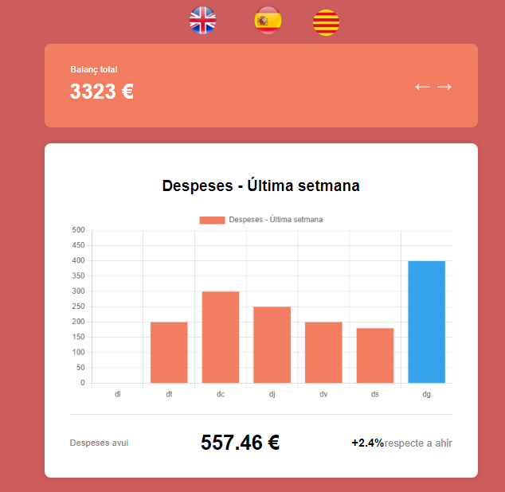
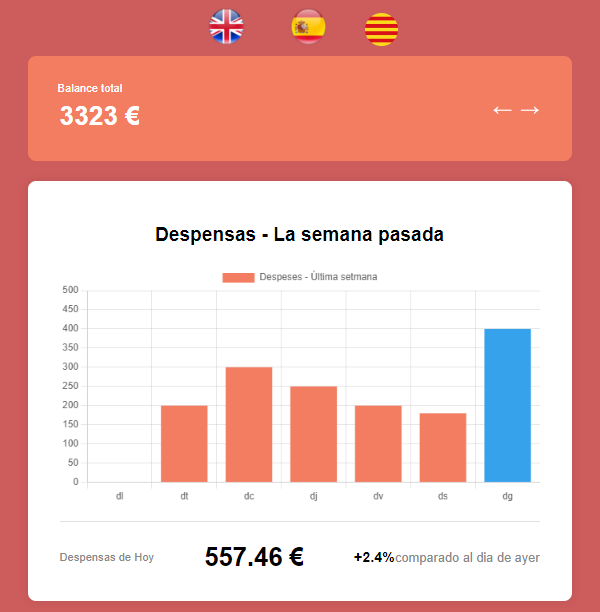
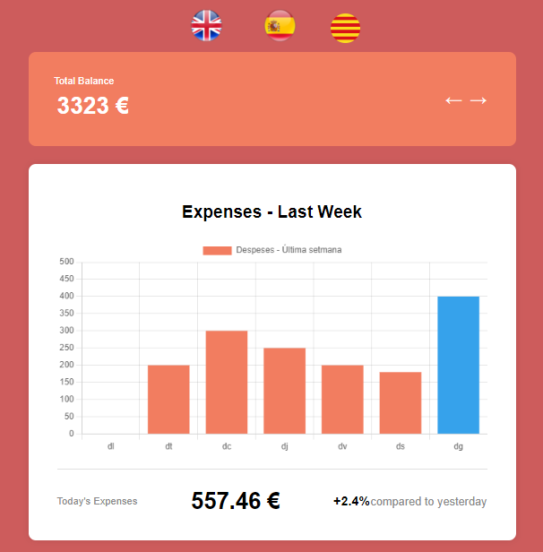

# Dashboard de Gastos

Este proyecto es una aplicación de Dashboard de Gastos construida con React, Redux y i18next para la internacionalización. La aplicación incluye gráficos de gastos, visualización de balances y soporte para tres idiomas (inglés, español y catalán).

## Estructura del Proyecto

src/<br>
├── assets/<br>
│ ├── catalunya.png<br>
│ ├── react.svg<br>
│ ├── spain.png<br>
│ ├── united_kingdom.png<br>
├── components/<br>
│ ├── LanguageSwitcher/<br>
│ │ ├── LanguageSwitcher.css<br>
│ │ ├── LanguageSwitcher.jsx<br>
│ ├── ExpensesChart.jsx<br>
│ ├── PercentageChange.jsx<br>
│ ├── TodayExpense.jsx<br>
│ ├── TotalBalance.jsx<br>
├── i18n/<br>
│ ├── i18n.jsx<br>
├── mocks/<br>
│ ├── handlers.js<br>
│ ├── server.js<br>
├── pages/<br>
│ ├── ExpensesView.jsx<br>
│ ├── TotalBalanceCard.jsx<br>
├── redux/<br>
│ ├── store.js<br>
├── reduxSlices/<br>
│ ├── expenses/<br>
│ │ ├── expensesSlice.js<br>
├── tests/<br>
│ ├── Balance.test.jsx<br>
│ ├── ExpensesView.test.jsx<br>
│ ├── PercentageChange.test.jsx<br>
│ ├── setupTests.jsx<br>
│ ├── TodayExpense.test.jsx<br>
│ ├── TotalBalance.test.jsx<br>
│ ├── TotalBalanceCard.test.jsx<br>
├── App.css<br>
├── App.jsx<br>
├── index.css<br>
├── main.jsx<br>


## Instalación

Para instalar y ejecutar esta aplicación localmente, sigue los siguientes pasos:

1. Clona el repositorio:
   ```bash
   git clone https://github.com/LucasFeli/S8.-Inprocode.git
   ```

   2. Navega al directorio del proyecto:

   - cd S8.Inprocode

3. Instala las dependencias:
    ```sh
     npm install
    ```

## Ejecución
Para ejecutar la aplicación en modo de desarrollo, usa el siguiente comando:
```sh
npm run dev
```

- La aplicación estará disponible en http://localhost:5173.

## Pruebas
Este proyecto utiliza Vitest y React Testing Library para las pruebas. Para ejecutar las pruebas, usa el siguiente comando:

```sh
npm run test
```

## Internacionalización
La aplicación soporta tres idiomas: inglés, español y catalán. La configuración de i18next se encuentra en el archivo src/i18n/i18n.jsx.

## Cambiar Idioma
Para cambiar el idioma, utiliza el componente LanguageSwitcher ubicado en src/components/LanguageSwitcher/LanguageSwitcher.jsx. Este componente permite cambiar entre los tres idiomas soportados.

## Configuración de i18next
El archivo de configuración para i18next se encuentra en src/i18n/i18n.jsx. Aquí se definen los recursos para los tres idiomas soportados y la configuración inicial de i18next.

## Dependencias Principales

- React
- Redux
- react-redux
- i18next
- react-i18next
- chart.js
- react-chartjs-2
- @reduxjs/toolkit
- @testing-library/react
- @testing-library/jest-dom
- vitest
- msw

## Estructura de Carpetas

- src/assets/
Contiene los activos de imagen utilizados en la aplicación.

- src/components/
Contiene los componentes reutilizables de la aplicación, incluyendo el LanguageSwitcher.

- src/i18n/
Contiene la configuración de i18next.

- src/mocks/
Contiene la configuración de MSW (Mock Service Worker) para simular las API.

- src/pages/
Contiene las vistas principales de la aplicación como ExpensesView y TotalBalanceCard.

- src/redux/
Contiene la configuración del store de Redux.

- src/reduxSlices/
Contiene los slices de Redux, como expensesSlice.

- src/tests/
Contiene las pruebas unitarias para los componentes y vistas.

## Contribuciones

Las contribuciones son bienvenidas. Por favor, abre un issue o envía un pull request para contribuir a este proyecto.

## Capturas de Pantalla

- Catalan


- Español


-Ingles



### Notas

1. Asegúrate de reemplazar `<URL_DEL_REPOSITORIO>` con la URL real de tu repositorio.
2. Este README asume que utilizas npm. Si utilizas otro gestor de paquetes como yarn, ajusta los comandos de instalación y ejecución en consecuencia.
3. El archivo `README.md` proporciona una visión general completa del proyecto, incluyendo la estructura de las carpetas, las instrucciones de instalación y ejecución, la configuración de i18next, y cómo ejecutar las pruebas.

Con este README, cualquier persona que clone tu proyecto debería ser capaz de entender la estructura del proyecto, instalar las dependencias necesarias, ejecutar la aplicación y ejecutar las pruebas.
